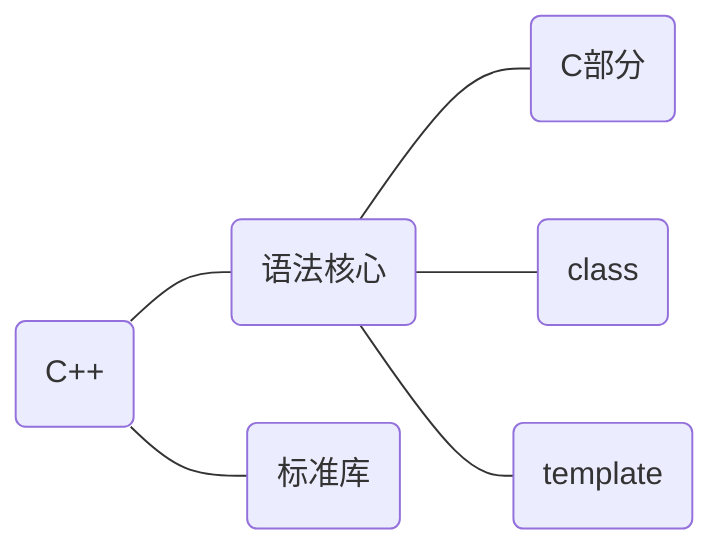

[toc]



> C++语法核心的C部分并不是完全指c语言
>
> C++编程风格：面向过程(Process-oriented)、面向对象(Object-oriented)、基于对象、泛型(Generic)...

## c++纵览

* main函数

  * 返回类型必须是int，返回0表示执行成功，非0值的含义由系统确定

    > cstdlib头文件定义了两个预处理变量，分别表示成功(EXIT_SUCCESS)、失败(EXIT_FAILURE)。

  * 命令行参数`int main(int argc, char* argv[])`，argc是参数个数(包含程序名)，argv是具体的参数数组(argv[0]是程序名)

  * main函数可以没有return语句，由编译器隐式插入return 0

* 编译器忽略注释，注释对程序的行为和性能不会有任何影响，但是c++多行注释(/**/)嵌套会产生错误

* 四种对象类型

  * 自动对象(automatic object)，定义处创建，块尾处销毁，定义处到块尾可见

  * 局部静态对象(local static object)，第一次执行时创建并初始化，程序终止时销毁，定义处到块尾可见

    > 自动对象和局部静态对象都属于局部对象，但一般默认局部对象是自动对象

  * 全局变量，程序运行时创建，程序终止时销毁，默认本文件内可见

  * 动态对象，new时创建，delete时销毁。

* 对象初始化方式

  * 默认初始化：全局变量初始化为0，局部变量未定义，类对象调用默认构造函数。
  * 复制初始化：=，先调用构造函数(可能省略)，再调用拷贝构造函数
  * 直接初始化：()，调用构造函数。
  * [列表初始化](https://zh.cppreference.com/w/cpp/language/list_initialization)：{}，首先当成元素初始值，无法完成再考虑构造函数。
  * [值初始化](https://zh.cppreference.com/w/cpp/language/value_initialization)：空(花)括号，内置类型元素设置为0，类对象调用默认构造函数。

  > 类内初始值，即给类的属性提供初始值，只能使用等号或使用花括号的形式初始化
  
* 优先级、结合律、求值顺序

  * 优先级、结合律共同决定了表达式的运算顺序

  * 求值顺序是运算对象的求值顺序，c++只规定了四个运算符的求值顺序（&& || ?: ,)

    ```c++
    //以下程序未定义
    int i = 0;
    std::cout << i << " " << ++i << std::endl;	//典型的未定义的求值顺序
    //优先级规定，先计算g的返回值与h的返回值相乘
    //结合律规定，f的返回值先与g和h的乘积相加，所得结果再与j相加
    //求值顺序，f，g，h，j的调用顺序并未规定
    f() + g() * h() + j();
    ```

* extern关键字

  * 只声明变量而不定义 

    >修饰全局变量不要显式初始化，否则会使变量定义，修饰局部变量显式初始化会报错
    >
    >用法：想要某个全局变量在多个文件都可见，头文件声明，源文件定义，其他文件包含
    
  * 链接指示，用来指示其它语言，从而使用或者导出其它语言(如C)。
  
* static关键字

  * 静态局部变量：全局数据区，执行到才初始化(默认为0)，程序结束时销毁，块作用域
  * 静态(私有)全局变量：只在本文件内可见
  * 静态(私有)函数：只在本文件内可见
  * [类的静态属性](https://zh.cppreference.com/w/cpp/language/static)：全局数据区，类内是声明，须在类外定义(不要static)
  * [类的静态方法](https://zh.cppreference.com/w/cpp/language/static)：无this指针，类外定义不要static

* 指针和引用

  * 指针变量是对象，它存储的是地址值(和机器字长位数一样)，引用是某个对象的别名
  * 可以定义多级指针，但不能显式定义引用的引用，也不能定义指向引用的指针(因为引用不是对象)
  * 引用必须显式初始化，指针不需要但是建议
  * 引用只能绑定最初的对象，指针可以更换绑定的对象

  > 虽然引用是对象的别名，但是c++标准并没有规定引用是否占内存
  >
  > 绑定到字面值、表达式的const引用实质上绑定的是一个临时量，作用域有严格限制，所以以下代码非法
  >
  > ```c++
  > const std::string& fun()
  > {
  >     return "hello world";	//局部临时量
  > }
  > ```

* NULL和nullptr

  * NULL是头文件cstdlib的预处理变量，为0
  * nullptr是c++11新增关键字，使用起来更方便，推荐使用
  
  > nullptr在函数重载和模板上更安全、方便
  
* inline

  * inline放在函数声明/定义返回类型之前，将函数声明为内联函数，类成员函数也可以inline，而且类内定义的成员函数默认内联。
  * 内联函数会向编译器发出在函数调用点展开的请求(编译器可以忽略)，以求减少函数调用开销。
  * 一般含有递归或行数较多的内联函数编译器会忽略，不予展开。
  * 内联函数可以多次定义，一般将内联函数放在头文件，如果是类成员函数，就和类声明一起放在头文件。

* const和constexpr

  * const

    * const修饰变量表明这个变量只可以被初始化，之后不能被直接修改，值既可以是编译时初始化也可以是运行时初始化

      > const分为底层const和顶层const，本身不能改变为顶层const，绑定的对象不能改变为底层const
      
    * const放在成员函数形参列表后，表明该函数是常量成员函数，表明this指针是一个指向常量的const指针，构造函数不能用const修饰。如果一个const函数以引用的形式返回`*this`则只能返回`const引用`

    * const修饰类对象，表明该对象是常量对象，常量对象及其引用和指针只能调用常量成员函数，虽然非常量对象可以调用常量版本或非常量版本，但非常量版本是更好匹配。

      > 即const成员函数和非const成员函数构成重载，调用过程中存在this的const属性转换。(P248)

  * constexpr

    * constexpr修饰变量表明这个变量是一定是常量，且必须用常量表达式初始化，值在编译时初始化。

      > 常量表达式在编译时就能得到计算结果
    
    * constexpr放在函数返回类型之前，声明为constexpr函数，能用于常量表达式，隐式内联。

      > constexpr函数不一定返回常量表达式，但如果放在需要常量表达式而又没返回常量表达式的地方将报错。

* mutable

  * mutable修饰类的数据成员表明该数据成员在任何成员函数内可以修改，即使是在const成员函数内。

* typedef和using

  > 类型别名同样受类的访问权限控制，即也有public，private，protected之分。在类中，类型别名必须先定义而后才能使用，与一般成员不同，因此类型别名通常出现在类声明开始的地方。

  ```c++
  typedef char* pstring;
  const pstring cstr = 0;		//cstr是const指针，而不是指向const的指针
  //以下别名等价
  typedef int point_arr[4];
  using point_arr = int [4];
  //p是指向容量为4的int数组的指针
  point_arr* p;
  ```

* auto和decltype

  * 使用auto 需要注意的地方

    * auto会去除顶层const和引用，要保留必须手动加上

    * 保留引用，必然也保留顶层const属性

      ```c++
      int a = 0;
      int& b = a;
      const int c = 0;
      const int& d = c;
      auto x = b; //x是int类型，要保留引用属性，应该这样声明auto& x = b;
      auto y = c;	//y是int类型，要保留顶层const属性，应该这样声明const auto y = c;
      auto& z = d; //z是const int& 类型
      const auto& z = 10; //对于字面值常量，需要写明const 
      ```
      
    * auto作用于数组时，得到的是指针类型

    > auto可用于函数的尾置返回

  * 使用decltype需要注意的地方

    * decltype不会去除const和引用

    * decltype作用于左值表达式(不是单一变量)则结果是引用

      > decltype(*p)和decltype((p))结果都是引用，decltype(x)取决于x的类型
      
    * decltype作用于数组时，得到的是数组类型

* 数组转指针：大多数表达式中，数组类型自动转换成指向首元素的指针，但当数组作为`decltype、&、sizeof、typeid`的运算对象时，不会转换。

* 下标类型

  * 数组的下标类型是size_t，定义在头文件cstddef，是一种无符号类型，与机器相关。
  * vector、string的下标类型(size返回值也)是vector::size_type、string::size_type

* sizeof、siziof...

  * sizeof
  * 可作用于表达式(sizeof expr)，也可作用于类型(sizeof (type))，结果是字节数(size_t)
    * 作用于指针，求的是指针本身(4/8)，作用于解引用，指针不需要有效

* 强制类型转换：一般应该避免使用，尤其是reinterpret_cast

  * static_cast：不包含const的明确定义的类型转换都可以使用，可以将左值转化为右值引用
  * dynamic_cast：运行时转换，在公有继承树上强制转换指针或引用
  * const_cast：改变对象的底层const，去除const不是为了修改，而是适应已有的接口
  * reinterpret_cast：为运算对象在位模式层次重新提供解释

* 异常

  * try-catch配对使用，如果try没有匹配的catch，程序将沿着与函数调用链相反的方向搜寻，找不到则转到terminate库函数
  * catch括号内的对象声明可以未命名
  * 每个标准库异常类都只定义了what()无参成员函数，返回`const char*`
  * exception、bad_alloc、bad_cast只能默认初始化，其余异常类不能使用默认初始化

* 可变行参函数

  * 实参相同类型，initializer_list<T>，需传{}参数
  * 实参不同类型，可变参数模板
  * c风格，省略符
  
* 函数匹配过程

  * 第一步，确定候选函数(candidate function)，候选函数两个特征：一是与被调用函数同名，二是其声明在调用点可见。
  
  * 第二步，确定可行函数(viable function)，可行函数两个特征：一是形参数目与调用提供的实参数目相等，二是每个实参的类型与对应的形参类型相同，或者能转换成形参的类型。
  * 第三步，寻找最佳匹配，有且只有一个函数满足：一该函数每个实参的匹配都不劣于其他可行函数需要的匹配，二至少有一个实参的匹配优于其他可行函数提供的匹配。
  
  >函数匹配等级
  >
  >1. 精确匹配
  >   * 形参与实参类型完全相同
  >   * 实参从数组类型或函数类型转换成对应的指针类型
  >   * 向实参添加或删除顶层const
  >2. 实参到形参增加了底层const
  >3. 类型提升(字节短的转换成字节长的，同字节则有符号转换成无符号的)
  >4. 算数类型转换，指针类型转换(0、nullptr、void*、多态)
  >5. 类自定义的转换
  
* 函数参数匹配

  * 函数形参匹配时，顶层const会被忽略，如同时定义`void fcn(const int i) 和 void fcn(int i)`会产生二义性，产生语法错误，底层const不会忽略。

  * 函数名字查找发生类型匹配之前，先在本层作用域查找，一旦查到就不再向外层作用域查找。
  
  * 数组类型作为形参，会自动转换为指针，如`void print(const int*)  void print(const int[])`和`void print(const int[10])`完全等价，但数组的引用或指针作为形参必须完全匹配，如`void print(const int (&arr)[10])`和`void print(int (*martrix)[10])`。多维数组做形参，第二维及其以后维度的大小都是数组类型的一部分，不能省略。
  
    > 数组转换为指针的后果之一就是，不能使用范围for循环
  
* 函数返回数组的指针/引用或函数指针的四种方法

  * 类型别名

  * 直接声明

  * 尾置返回类型

  * decltype

    ```c++
    typedef int arr[10];							typedef bool func(int, int);
    using arr = int [10];							using func = bool(int, int);
    arr* func(int i);									func* function(int i);
    
    int (*func(int i)) [10];						bool (*function(int i))(int, int);
    
    auto func(int i) -> int (*) [10];		auto function(int i) -> bool (*)(int, int);
    
    decltype(arr)* func(int i);				decltype(func)* functoin(int i);
    ```

* 预处理变量

  * 头文件保护符(一般头文件都要)

    ```c++
    #ifndef HEADER_H
    #define HEADER_H
  ​```
    ​```
  ​```
    #endif
    ```
    
  * assert预处理宏：定义在cassert头文件中，无需std命名空间，直接使用。`assert(expr)`，expr为假，输出错误信息终止运行，expr为真，什么也不做。
  
  * NDEBUG预处理变量：define后，能使assert什么也不做(必须在cassert头文件包含之前)。
  
  * 编译器定义的变量
  
    * `__func__`，局部静态变量，存放函数的名字。
  
  * 预处理器定义的名字
  
    * `__FILE__`存放文件名的字符串字面值
    * `__LINE__`存放当前行号的整型字面值
    * `__TIME__`存放文件编译时间的字符串字面值
    * `__DATE__`存放文件编译日期的字符串字面值
  
* this

  * 成员函数通过名为this的隐式参数来访问调用它的那个对象
  * this是指向类对象的常量指针。

* 构造函数：

  > 严格意义上，只有构造函数初始化列表才属于真正意义的初始化，被初始化列表忽略的数据成员将被类内初始值初始化或者默认初始化

  * 默认构造函数：不需要提供任何参数即可调用的构造函数。当类未定义任何构造函数时由编译器创建合成的默认构造函数，若存在类内初始值，则用类内初始值初始化成员，否则进行默认初始化。如果需要编译器合成的构造函数但又自定义了构造函数，可以声明默认构造函数并在形参列表后加`= default`要求编译器生成构造函数(一般有类内初始值)。
  * 委托构造函数：初始化列表有唯一的入口，即类名。委托构造函数将自己的一些任务委托给其他构造函数。

* 友元需要注意的地方：

  * 友元不是类成员，不受访问说明符的约束。
  * 友元声明仅仅指定了修饰函数/类对该类的访问权限，并非一个一般意义的函数/类声明。要使能够正常使用某个友元函数，还需在友元声明外专门对友元函数进行声明，一般放在类声明外部且同一个头文件中。
  * 友元声明只能放在类内部，但在类内出现位置不限，一般最好放在类声明的开始或结束。
  * 友元函数可以定义在类内部，这样的函数隐式内联。
  * 友元关系不存在传递性。
  * 让成员函数作为友元函数，有严格的组织方式(P252).

* 类的作用域

  * 一个类就是一个作用域，一旦遇到类名，定义的剩余部分就在类的作用域之内。(类外定义的成员函数，参数如果是类内类型，则无需域运算符，返回类型如果是类内类型，则需要域运算符)

  * 类的定义分两步，首先，编译成员声明。直到类全部可见后编译函数体。

    > 结果就是，成员函数体内可以使用类的任意成员。但编译成员声明依然严格的按照向前搜寻。即成员函数的返回类型、形参类型，在使用前必须可见。

  * 类中不能重新定义外层作用域的名字。即类中出现外层作用域的名字则视为一种类型，不能重新typedef或者using。(所以一般类型别名放在类声明开始。)

* 三五法则：拷贝构造函数，拷贝赋值运算符，析构函数，移动构造函数，移动赋值运算符同时出现。

* 虚析构函数：执行指针动态绑定的类的析构函数，而不是指针的静态类型的析构函数。

* 含有（纯）虚函数应该有虚析构函数

* 第一次虚函数不要在类内定义

* override表明该函数覆写了父类的虚函数，只能在类声明处写，不能在类定义出写

* 编译器默认创建的类成员：无参构造函数，拷贝构造函数，移动构造函数，复制赋值运算符，移动赋值运算符，析构函数

* 模板实参推断规则

  ```c++
  //引用折叠：X& &、X& &&、X&& &都会折叠成X&，X&& &&会折叠成X&&
  template <typename T> void f(T&);
  template <typename T> void f(const T&);
  template <typename T> void f(T&&)
  ```

  

  