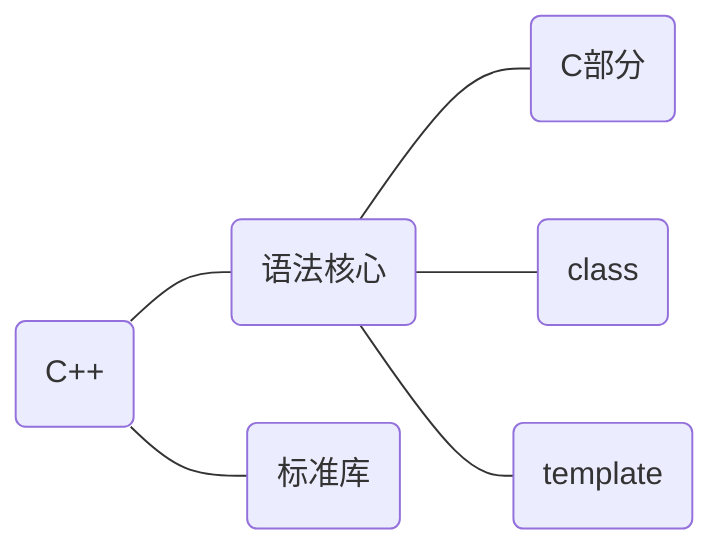

[toc]



> C++语法核心的C部分并不是完全指c语言
>
> C++编程风格：面向过程(Process-oriented)、面向对象(Object-oriented)、基于对象、泛型(Generic)...

## c++纵览

* main函数返回类型必须是int

* 编译器忽略注释，注释对程序的行为和性能不会有任何影响，c++多行注释(/**/)嵌套会产生错误

* 类对象的初始化方式

  * 默认初始化：不传参数，默认处理，调用默认构造函数
  * 拷贝初始化：使用等号初始化，
  * 直接初始化：使用括号初始化，或者大括号初始化(列表初始化)，

  > 列表初始化，首先尝试直接用列表元素初始化，如果不匹配尝试使用构造函数

* extern关键字

  * 只声明变量而不定义 

  > 修饰全局变量不要显式初始化，否则会使变量定义，修饰局部变量显式初始化会报错
  >
  > 用法：想要某个全局变量在多个文件都可见，头文件声明，源文件定义，其他文件包含
  
  * 

* 指针和引用

  * 指针变量是对象，它存储的是地址值(具有和机器字长一样的二进制位数)，引用是某个对象的别名
  * 可以定义多级指针，但不能显式定义引用的引用，也不能定义指向引用的指针(因为引用不是对象)
  * 引用必须显式初始化，指针不必但建议
  * 引用只能绑定最初的对象，指针可以更换绑定的对象

  > 虽然引用是对象的别名，但是c++标准并没有规定引用是否占内存

* const、constexpr

  * const修饰变量表明这个变量只可以被初始化，而不能被直接修改，值既可以是编译时初始化也可以是运行时初始化

  * constexpr修饰变量表明这个变量是一定是常量，且必须用常量表达式初始化，即值在编译时初始化。

    > 常量表达式在编译时就能得到计算结果

* typedef和using

  ```c++
  typedef char* pstring;
  const pstring cstr = 0;		//cstr是const指针，而不是指向const的指针
  //以下别名等价
  typedef int point_arr[4];
  using point_arr = int[4];
  //p是指向容量为4的int数组的指针
  point_arr* p;
  ```

* auto和decltype

  * auto 使用需要注意的地方

    * auto会去除顶层const和引用，要保留必须手动加上

    * 保留引用，必然也保留顶层const属性

      ```c++
      int a = 0;
      int& b = a;
      const int c = 0;
      const int& d = c;
      auto x = b; //x是int类型，要保留引用属性，应该这样声明auto& x = b;
      auto y = c;	//y是int类型，要保留顶层const属性，应该这样声明const auto y = c;
      auto& z = d; //z是const int& 类型
      const auto& z = 10; //对于字面值常量，需要写明const 
      ```
      
    * auto作用于数组时，得到的是指针类型

  * decltype使用需要注意的地方

    * decltype不会去除const和引用

    * decltype作用于左值表达式(不是单一变量)则结果是引用

      > decltype(*p)和decltype((p))结果都是引用，decltype(x)取决于x的类型
      
    * decltype作用于数组时，得到的是数组类型

* 优先级、结合律、求值顺序

  * 优先级、结合律共同决定了表达式的运算顺序

  * 求值顺序是运算对象的求值顺序，c++只规定了四个运算符的求值顺序（&& || ?: ,)

    ```c++
    //以下程序未定义
    int i = 0;
    std::cout << i << " " << ++i << std::endl;
    //优先级规定，g的返回值与h的返回值相乘
    //结合律规定，f的返回值先与g和h的乘积相加，所得结果再与j相加
    //求值顺序，f，g，h，j的调用顺序并未规定
    f() + g() * h() + j();
    ```

* sizeof、siziof...

  * 可作用于表达式(sizeof expr)，也可作用于类型(sizeof (type))，结果是字节数(size_t)
  * 作用于指针，求的是指针本身(4/8)，作用于解引用，指针不需要有效

* static_cast、dynamic_cast、const_cast和reinterpret_cast

  * static_cast不包含底层const的明确定义的类型转换都可以
  * const_cast只能改变对象的底层const，常用于函数重载场合
  * reinterpret_cast为运算对象的位模式提供较低层次上的重新解释P145

* 类内初始化

  * 不能使用圆括号直接初始化P65