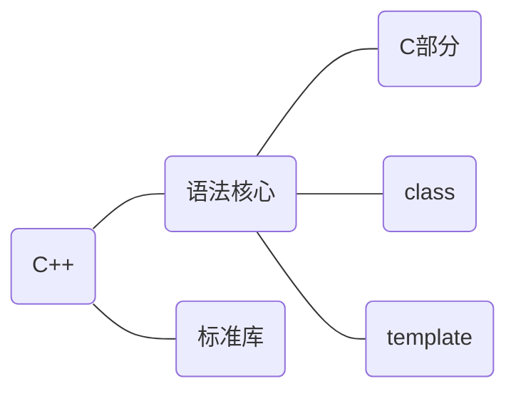

[toc]



> C++语法核心的C部分并不是完全指c语言
>
> C++编程风格：面向过程(Process-oriented)、面向对象(Object-oriented)、基于对象、泛型(Generic)...

## c++纵览

* main函数

  * 返回类型必须是int，返回0表示执行成功，非0值的含义由系统确定

    > cstdlib头文件定义了两个预处理变量，分别表示成功(EXIT_SUCCESS)、失败(EXIT_FAILURE)。

  * 命令行参数`int main(int argc, char* argv[])`，argc是参数个数(包含程序名)，argv是具体的参数数组(argv[0]是程序名)

  * main函数可以没有return语句，由编译器隐式插入return 0

* 编译器忽略注释，注释对程序的行为和性能不会有任何影响，但是c++多行注释(/**/)嵌套会产生错误

* 四种对象类型

  * 自动对象(automatic object)，定义处创建，块尾处销毁，定义处到块尾可见

  * 局部静态对象(local static object)，第一次执行时创建并初始化，程序终止时销毁，定义处到块尾可见

    > 自动对象和局部静态对象都属于局部对象，但一般默认局部对象是自动对象

  * 全局变量，程序运行时创建，程序终止时销毁，默认本文件内可见

* 对象初始化方式

  * 默认初始化：未显式初始化时，内置类型变量若是全局变量初始化为0，局部变量未定义，类对象调用默认构造函数。
  * 值初始化：一般用在标准库类型中(如vector只指定元素个数，元素将执行值初始化)，内置类型元素设置为0，类对象调用默认构造函数。
  * 拷贝初始化：使用等号初始化，类对象调用拷贝构造函数
  * 直接初始化：使用括号初始化，类对象调用普通构造函数，内置类型直接初始化
  * 列表初始化：花括号里提供初始元素的列表，用提供的值初始化对象。

  > 使用花括号会首先考虑列表初始化，当无法完成时，将尝试调用构造函数。
  >
  > 类内初始值，即给类的属性提供初始值，只能使用拷贝初始化或使用花括号的形式初始化
  >

* 优先级、结合律、求值顺序

  * 优先级、结合律共同决定了表达式的运算顺序

  * 求值顺序是运算对象的求值顺序，c++只规定了四个运算符的求值顺序（&& || ?: ,)

    ```c++
    //以下程序未定义
    int i = 0;
    std::cout << i << " " << ++i << std::endl;	//典型的未定义的求值顺序
    //优先级规定，先计算g的返回值与h的返回值相乘
    //结合律规定，f的返回值先与g和h的乘积相加，所得结果再与j相加
    //求值顺序，f，g，h，j的调用顺序并未规定
    f() + g() * h() + j();
    ```

* extern关键字

  * 只声明变量而不定义 

    >修饰全局变量不要显式初始化，否则会使变量定义，修饰局部变量显式初始化会报错
    >
    >用法：想要某个全局变量在多个文件都可见，头文件声明，源文件定义，其他文件包含
  
* 指针和引用

  * 指针变量是对象，它存储的是地址值(和机器字长位数一样)，引用是某个对象的别名
  * 可以定义多级指针，但不能显式定义引用的引用，也不能定义指向引用的指针(因为引用不是对象)
  * 引用必须显式初始化，指针不需要但是建议
  * 引用只能绑定最初的对象，指针可以更换绑定的对象

  > 虽然引用是对象的别名，但是c++标准并没有规定引用是否占内存
  >
  > 绑定到字面值、表达式的const引用实质上绑定的是一个临时量，作用域有严格限制，所以以下代码非法
  >
  > ```c++
  > const std::string& fun()
  > {
  >     return "hello world";	//局部临时量
  > }
  > ```

* NULL和nullptr

  * NULL是头文件cstdlib的预处理变量，为0
  * nullptr是c++11新增关键字，使用起来更方便，推荐使用
  
  > nullptr在函数重载和模板上更安全、方便
  
* const和constexpr

  * const修饰变量表明这个变量只可以被初始化，之后不能被直接修改，值既可以是编译时初始化也可以是运行时初始化

    > const分为底层const和顶层const，本身不能改变为顶层const，绑定的对象不能改变为底层const
    >
    
  * constexpr修饰变量表明这个变量是一定是常量，且必须用常量表达式初始化，值在编译时初始化。

    > 常量表达式在编译时就能得到计算结果

  > 一般尽可能使用const和constexpr

* typedef和using

  ```c++
  typedef char* pstring;
  const pstring cstr = 0;		//cstr是const指针，而不是指向const的指针
  //以下别名等价
  typedef int point_arr[4];
  using point_arr = int[4];
  //p是指向容量为4的int数组的指针
  point_arr* p;
  ```

* auto和decltype

  * 使用auto 需要注意的地方

    * auto会去除顶层const和引用，要保留必须手动加上

    * 保留引用，必然也保留顶层const属性

      ```c++
      int a = 0;
      int& b = a;
      const int c = 0;
      const int& d = c;
      auto x = b; //x是int类型，要保留引用属性，应该这样声明auto& x = b;
      auto y = c;	//y是int类型，要保留顶层const属性，应该这样声明const auto y = c;
      auto& z = d; //z是const int& 类型
      const auto& z = 10; //对于字面值常量，需要写明const 
      ```
      
    * auto作用于数组时，得到的是指针类型

  * 使用decltype需要注意的地方

    * decltype不会去除const和引用

    * decltype作用于左值表达式(不是单一变量)则结果是引用

      > decltype(*p)和decltype((p))结果都是引用，decltype(x)取决于x的类型
      
    * decltype作用于数组时，得到的是数组类型

* sizeof、siziof...

  * sizeof
  * 可作用于表达式(sizeof expr)，也可作用于类型(sizeof (type))，结果是字节数(size_t)
    * 作用于指针，求的是指针本身(4/8)，作用于解引用，指针不需要有效

* static_cast、dynamic_cast、const_cast和reinterpret_cast

  * static_cast不包含底层const的明确定义的类型转换都可以使用
  * const_cast只能改变对象的底层const，常用于函数重载场合
  * reinterpret_cast为运算对象的位模式提供较低层次上的重新解释

  > 一般应该尽量避免使用强制类型转换，尤其是reinterpret_cast

* 异常

  * try-catch配对使用，如果try没有匹配的catch，程序将沿着与函数调用链相反的方向搜寻，找不到则转到terminate库函数
  * catch括号内的对象声明可以未命名
  * 每个标准库异常类都只定义了what()无参成员函数，返回`const char*`
  * exception、bad_alloc、bad_cast只能默认初始化，其余异常类不能使用默认初始化

* 函数形参匹配

  * 函数形参匹配时，顶层const会被忽略，如同时定义`void fcn(const int i) 和 void fcn(int i)`会产生二义性，产生语法错误。

  * 数组类型作为形参，会自动转换为指针，如`void print(const int*)  void print(const int[])`和`void print(const int[10])`完全等价，但数组的引用或指针作为形参必须完全匹配，如`void print(const int (&arr)[10])`和`void print(int (*martrix)[10])`。多维数组左形参，第二维及其以后维度的大小都是数组类型的一部分，不能省略。
  
    > 数组转换为指针的后果之一就是，不能使用范围for循环
  
* 函数返回数组的指针或引用的四种方法

  * 类型别名

  * 直接声明

  * 尾置返回类型

  * decltype

    ```c++
    typedef int arr[10];
    
    ```

* 预处理变量

  * 头文件保护符(一般头文件都要)

    ```c++
    #ifndef HEADER_H
    #define HEADER_H
  ​```
    ​```
  ​```
    #endif
    ```
    
  
* 下标类型

  * 数组的下标类型是size_t，定义在头文件cstddef，是一种无符号类型，与机器相关。
  * vector、string的下标类型(size返回值也)是vector::size_type、string::size_type

* 三五法则：拷贝构造函数，拷贝赋值运算符，析构函数，移动构造函数，移动赋值运算符同时出现。

* 虚析构函数：执行指针动态绑定的类的析构函数，而不是指针的静态类型的析构函数。

* 含有（纯）虚函数应该有虚析构函数

* 第一次虚函数不要在类内定义

* override表明该函数覆写了父类的虚函数，只能在类声明处写，不能在类定义出写