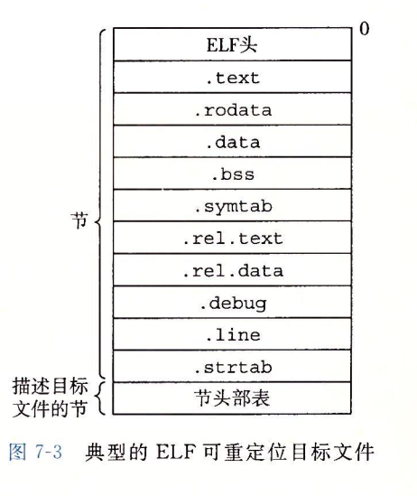

## 链接

[编译器驱动程序](#编译器驱动程序)

[链接基础概念](#链接基础概念)

[目标文件](#目标文件)

[符号解析](#符号解析)

[重定位](#重定位)

### 编译器驱动程序

* 编译器驱动程序：预处理器、编译器、汇编器和链接器。

* C语言从源代码到可执行目标文件的流程：
  * C预处理器(cpp)：将C源文件翻译成.i文件。
  * C编译器(cc1)：将.i文件翻译成汇编语言文件.s。
  * 汇编器(as)：将.s文件翻译成可重定位目标文件.o。
  * 链接器(ld)：将.o文件以及一些必要的系统目标文件组合起来，创建可执行目标文件。
  * shell中执行：将调用一个叫做加载器(loader)的函数，它将可执行文件的代码和数据复制到内存中，然后将控制转移到这个程序的开头。

### 链接基础概念

* 定义：链接是将各种代码和数据片段收集并组合为一个单一文件的过程，这个文件可被加载到内存并执行。
* 作用：实现分离式编译。可以将大的源文件分解为小的模块，当一个模块变更时，只需要重新编译该模块，并重新链接应用，不需要重新编译其它文件。
* 分类
  * 编译时的静态链接。
  * 加载时共享库的动态链接。
  * 运行时共享库的动态链接。
* 链接器的两大任务：符号解析、重定位。

### 目标文件

* 目标文件是按特定的格式组织的，各个系统目标文件各不相同。Windows使用PE格式，MacOS-X使用Mach-O格式，现代x86-64 Linux和Unix系统使用ELF格式。ELF目标文件分三种：可重定位目标文件、可执行目标文件和共享目标文件。其中共享目标文件是一种特殊的可重定位目标文件，可以在加载或者运行时被动态载入内存并链接。

  * 可重定位目标文件：具体详见`csapp 467`

    

    * `.text`是已编译程序的机器代码，`.rodata`是只读数据，例如switch语句的跳转表和printf语句中的格式串。
    * `.data`是已初始化的全局和静态C变量。`.bss`是未初始化的全局和静态C变量，以及所有被初始化为0的全局和静态C变量。目标文件区分已初始化和未初始化变量是为了空间效率，在目标文件中，未初始化变量不需要占据任何磁盘空间，仅仅是一个占位符，运行时，在内存中分配变量为0值。
    * `.symtab`是符号表，存放C程序中定义和引用的函数和全局变量信息，不需要-g选项。`.debug`存放调试符号表，`.line`存放源代码行号和`.text`中机器指令的映射，需要-g选项。`.strtab`是字符串表，包括`.symtab`、`.debug`节中的符号表以及节头部中的节名字。
    * `.rel.text`和`.rel.data`存储重定位相关的信息。

* 可执行目标文件

### 符号解析

* 每个可重定位目标模块m都有一个符号表，它包含m定义和引用的符号信息。有三种不同的符号：
  * 由模块m定义并能被其它模块引用的全局符号。
  * 由其它模块定义并被模块m引用的全局符号，也称外部符号。
  * 只被模块m定义和引用的局部符号。

### 重定位
