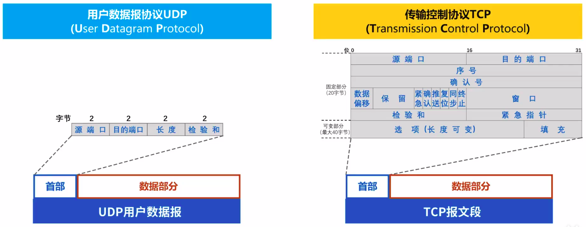
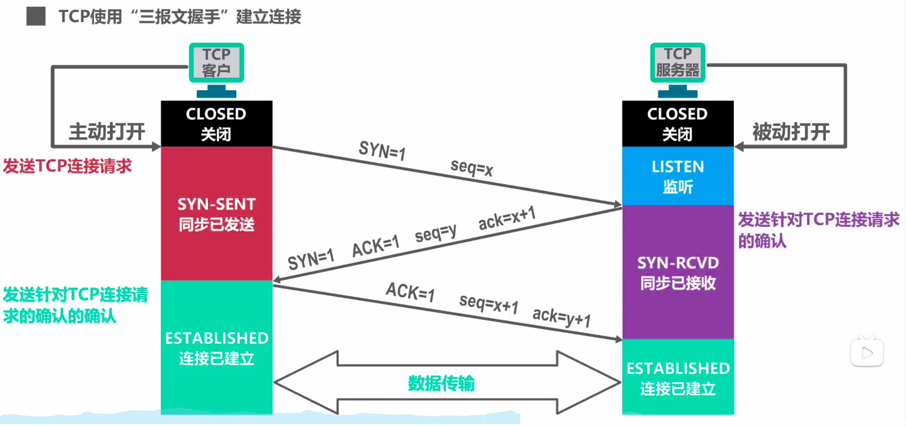
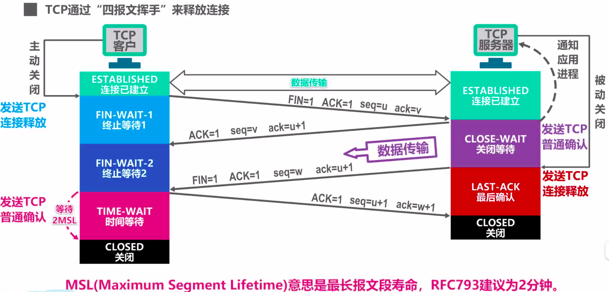

# 计算机网络

> 参考资料：[湖南科技大学计算机网络微课堂](https://www.bilibili.com/video/BV1c4411d7jb)

## 概述

* ISP：Internet Service Provider
* 接入网、核心网
* 三种交换方式
  * 电路交换：建立连接、通信、释放连接
  * 分组交换：构造发送、存储转发、接收还原
  * 报文交换
* 性能指标：K、M、G、T等单位进制用于存储时一般是$2^{10}$用于速率时一般是$10^3$
  * 速率：bps
  * 带宽：最大能传送数据的速率
  * 吞吐量：单位时间内成功地传送数据量
  * 时延：发送时延、传播时延、处理时延
  * 时延带宽积：传播时延*带宽
  * 往返时间：RTT(Round-Trip Time)
  * 利用率：信道利用率、网络利用率
  * 丢包率：分组丢包率
* 计算机网络体系结构
  * OSI七层：应表会传网数物
  * TCP/IP四层：应用层、传输层、网际层、网络接口层
  * 教学原理五层
    * [应用层](#应用层)：解决通过应用进程的交互来实现特定网络应用的问题，应用层报文。
    * [传输层](#传输层)：解决进程之间基于网络的通信问题，提供端到端的逻辑通信，TCP报文段，UDP数据报。
    * [网络层](#网络层)：解决分组在多个网络上传输(路由)的问题，提供主机之间的逻辑通信，IP数据报/分组。
    * [数据链路层](#数据链路层)：解决分组在一个网络或一段链路上传输的问题，链路层帧。
    * [物理层](#物理层)：解决在各种传输媒体上传输比特0和1的问题，物理层比特流。
* 网络拓扑结构
  * 总线型以太网：早期使用，传输媒体是同轴电缆，使用CSMA/CD
  * 星型以太网：目前主流，使用双绞线
    * 使用集线器HUB：逻辑上仍然是总线网，使用CSMA/CD，可以在物理层进行扩展(使用多个集线器)
    * 使用以太网交换机：为提高网络可靠性可增加冗余链路，使用以太网交换机生成树协议STP生成逻辑上的树状网络
* 网络互联设备
  * 中继器：工作在物理层，连接两段物理线路，放大衰减信号，从而延长网络距离。
  * 集线器(hub)：工作在物理层，相当于多口中继器，把端口输入的信号放大并转发到别的端口。
  * 网桥(bridge)：工作在数据链路层，连接两个局域网，根据mac地址选择是否转发。
  * 交换机(switch)：工作在数据链路层，相当于多个网桥的集成设备，收到帧后根据帧交换表查找目的MAC地址对应的端口号，帧交换表是自学习的。
  * 路由器：工作在网络层，收到报文后根据报文的类型(数据报文 or 路由报文)进行转发报文或更新路由表
* 冲突域和广播域
  * 中继器和集线器工作在物理层，既不隔离冲突域也不隔离广播域
  * 网桥和交换机工作在数据链路层，可以隔离冲突域，不能隔离广播域
  * 路由器工作在网络层，既隔离冲突域也隔离广播域

## 物理层

* 传输媒体：不属于任何一层
  * 同轴电缆、双绞线、光纤、电力线
  * 无线电波、微波、红外线、可见光
* 传输方式
  * 串行、并行
  * 同步、异步
  * 单工、半双工、全双工

* 通信原理：码元、编码、调制、波特率、比特率、......

## 数据链路层

* 三个重要任务
  
  * 封装成帧：帧头、帧尾、MTU、透明传输
  * 差错检测：CRC
  * 可靠传输：停止-等待协议SW、回退N帧协议GBN、选择重传协议SR
  
* 点对点信道的数据链路层
  
  * 无需MAC地址
  * 点对点协议PPP
    * 链路层协商：链路控制协议LCP
    * 认证协商：默认不认证、PAP、CHAP
    * 网络层协商：网络控制协议NCP(如IPCP、IPV6CP)
  
* 使用广播信道的数据链路层

  * 需要[以太网V2 MAC帧](https://zh.wikipedia.org/wiki/%E4%BB%A5%E5%A4%AA%E7%BD%91%E5%B8%A7%E6%A0%BC%E5%BC%8F)

  * 媒体接入控制MAC

    ```mermaid
    graph LR
    mac(媒体接入控制) --- static(静态划分信道)
    mac---dynamic(动态接入控制)
    static --- 频分多址
    static --- 时分多址
    static --- 码分多址
    dynamic --- control(受控接入)
    dynamic --- random(随机接入)
    control --- 集中控制
    control --- 分散控制
    random --- CSMA/CD
    random --- CSMA/CA
    ```

    * 静态划分信道通常在无线网络的物理层中使用，而不是在数据链路层中使用
    * 共享式以太网采用随机接入，但随着技术发展，具有更高性能的使用点对点链路和链路层交换机的交换式局域网在有线领域已完全取代共享式局域网，但由于无线信道的广播天性，无线局域网仍然使用共享媒体技术。
      * 共享式以太网的媒体接入控制协议CSMA/CD
      * 802.11局域网的媒体接入控制协议CSMA/CA

* ARP协议：根据IPv4地址获取mac地址

  * 每个主机上都有arp缓存表，可以自学习
  * arp请求报文：src：`macA`  dst：`FF-FF-FF-FF-FF-FF`
  * arp响应报文：src：`macB`  dst：`macA`
  * arp协议不能跨网络使用，路由器隔离广播域

* 虚拟局域网VLAN：将局域网内的设备划分成与物理位置无关的逻辑组技术

  * 同一个VLAN内部可以广播通信，不同VLAN之间不能广播通信
  * IEEE 802.1Q帧：扩展[以太网V2的MAC帧](https://zh.wikipedia.org/wiki/%E4%BB%A5%E5%A4%AA%E7%BD%91%E5%B8%A7%E6%A0%BC%E5%BC%8F)
  * 由交换机支持，而非用户主机处理

## 网络层

* 两种服务

  * 面向连接的虚电路服务：可靠通信由网络来保证，建立网络层连接
  * 无连接的数据报服务：可靠通信由主机来保证，降低网络传输的复杂度

* 报文格式

  <div align=center></div>
  
* IPv4编址方法

  * 分类编址：

    * 网络号+主机号
    * 可以分配A、B、C类地址

    <div align=center></div>

    * 主机号全0的地址是网络地址，主机号全1的地址是广播地址

    * 特殊IP地址

      | 网络号 | 主机号     | 作为源地址 | 作为目的地址 | 代表的意思                                           |
      | ------ | ---------- | ---------- | ------------ | ---------------------------------------------------- |
      | 0      | 0          | 可以       | 不可以       | 在本网络上的本主机(DHCP协议)                         |
      | 0      | host-id    | 可以       | 不可以       | 在本网络上的某台主机host-id                          |
      | 全1    | 全1        | 不可以     | 可以         | 首先广播地址，只在本网络上进行广播(各路由器均不转发) |
      | net-id | 0          | 不可以     | 不可以       | 网络地址，表示一个网络net-id                         |
      | net-id | 全1        | 不可以     | 可以         | 直接广播地址，对net-id上的所有主机进行广播(可跨网段) |
      | 127    | 非全0或全1 | 可以       | 可以         | 环回地址，用于本地软件环回测试                       |

      > * 私有地址
      >
      >   | 网络类别 | 网络号                  | 网络数 |
      >   | -------- | ----------------------- | ------ |
      >   | A        | 10                      | 1      |
      >   | B        | 172.16 ~ 172.31         | 16     |
      >   | C        | 192.168.0 ~ 192.168.255 | 256    |
      >
      > 169.254.0.0/16：链路本地地址，仅在链路上有效，不可路由。当主机不能通过DHCP获取IP地址时，用此方法生成一个。
      >
      > 更多IPv4特殊地址见[维基百科](https://zh.wikipedia.org/wiki/IPv4)

  * 划分子网：从主机号中借用一部分bit为子网号，使用子网掩码

  * 无分类编址：无分类域间路由选择CIDR

* IP信息配置

  * 静态配置

  * 动态配置

    * DHCP协议

      * 使用**68(Client)**和UDP 67(Server)

      * 角色：客户端、服务器、中继代理

      * 工作流程

        <div align=center></div>

* 网络地址转换NAT：缓解IPv4地址耗尽问题，间接提供了一些安全保护，间接提供“释放意外中断的TCP连接”的功能。

* ICMP协议：更加有效转发IP数据报，提高交付成功的机会

  * 两类报文
    * 差错报告报文
    * 询问报文

  * 应用：ping、tracert(在Linux版本中使用UDP，对应命令是traceroute)

* 路由选择协议

  ```mermaid
  graph LR
  route(路由选择) --- 静态路由选择 
  route --- dynamic(动态路由选择)
  dynamic --- IGP(内部网关协议)
  dynamic --- EGP(外部网关协议)
  IGP --- 路由信息协议RIP
  IGP --- 开放最短路径优先OSPF
  EGP --- 边界网关协议BGP
  ```

  > * RIP使用UDP 520端口；OSPF使用IP报文段；BGP使用TCP 179端口
  > * 因特网路由选择协议的特点
  >   * 自适应：动态路由选择
  >   * 分布式：路由器之间交换路由信息
  >   * 分层次：将因特网划分较小的自治系统(AS)
  >     * 域间路由选择：AS之间，外部网关协议EGP
  >     * 域内路由选择：AS内部，内部网关协议IGP


## 传输层

* 报文格式

  <div align=center></div>

* TCP和UDP

  | 用户数据报协议UDP    | 传输控制协议TCP                  |
  | -------------------- | -------------------------------- |
  | 无连接               | 面向连接，连接建立，释放连接     |
  | 支持单播、多播和广播 | 仅支持一对一通信                 |
  | 面向应用报文         | 面向字节流，全双工               |
  | 尽力而为，不可靠     | 可靠传输，支持流量控制和拥塞控制 |
  | 首部开销小，仅8字节  | 首部最小20字节，最大60字节       |

* TCP

  * 可靠传输

    * 收发数据基于以**字节**为单位的滑动窗口，每一端都有发送窗口和接收窗口
    * 累计确认、捎带确认
    * 超时重传

  * 连接建立与释放

    * 连接建立的目的

      * 使TCP双方感知对方存在
      * 使TCP双方协商一些参数(如最大窗口值、是否使用窗口扩大选项和时间戳选项等)
      * 使TCP双方能够对系统资源进行分配

    * 三次握手

      <div align=center></div>

    * 四次挥手

      <div align=center></div>

      > TCP的KeepAlive可选特性可以应对对端异常掉线的情况，若无KeepAlive，具有NAT功能的路由器也可在超时后中断连接。

  * 流量控制：接收方通过TCP首部中的“接收窗口”字段对发送方进行流量控制，避免发送方发送速率太快而填满接收方的缓存

    * 当发送方收到接收方“接收窗口”为0的确认报文段时，启动持续计时器，当计时器超时时，发送零窗口探测报文，以避免发送窗口大小为0时死锁

  * 拥塞控制：发送方通过拥塞控制算法调整发送速率，避免发送的数据填满整个网络

    * Reno
      * 初始化拥塞窗口(拥塞窗口是几就能发送几个MSS)、慢开始门限
      * 慢启动：发送方每收到一个对新报文段的确认时，就把拥塞窗口值就加1，所以拥塞窗口呈指数型增加，直到拥塞窗口到达慢开始门限。
      * 拥塞避免：发送方每个传输轮次将拥塞窗口加1，直到触发重传超时或重复确认。
      * 拥塞发生
        * 超时重传：将慢开始门限变为拥塞窗口的一半，拥塞窗口变为1，执行慢启动算法。
        * 快速重传-快恢复：重新设置慢开始门限和拥塞窗口，执行拥塞避免算法。

    * Tahoe：[相比Reno没有快速重传和快速恢复](https://zh.wikipedia.org/wiki/TCP%E6%8B%A5%E5%A1%9E%E6%8E%A7%E5%88%B6#TCP_Tahoe_%E5%92%8C_Reno)


## 应用层

* DNS

  * 使用UDP 53端口

  * 层次：... .三级域名.二级域名.顶级域名.

  * 域名解析的过程

    <div align=center></div>

  * 记录类型

    | type  | name     | value                        |
    | ----- | -------- | ---------------------------- |
    | A     | 主机域名 | IPv4地址                     |
    | AAAA  | 主机域名 | IPv6地址                     |
    | CNAME | 别名     | 真实域名                     |
    | NS    | 域       | 该域权威域名服务器的主机域名 |

* HTTP

  * HTTP 1.1：默认持久化连接、`Chuncked transfer-coding不依赖Content-Length`
  * HTTP 2.0：二进制、多路复用、服务端推送
  * [https通信过程](https://blog.csdn.net/weixin_44233929/article/details/105850317)：非对称加密传输对称加密的密钥，对称加密传输数据(不用非对称主要是效率)。[参考](https://zhuanlan.zhihu.com/p/36981565)
    * 客户端向服务端发送TLS版本号、可用加密算法、随机数C
    * 服务端向客户端发送确认的加密算法、证书、公钥、随机数S
    * 客户端验证证书合法性，生成预主密钥、会话密钥
    * 客户端通过公钥加密，发送预主密钥给服务端
    * 服务端接收，私钥解密，得到对称预主密钥
    * 服务端生成会话密钥
    * 客户端和服务端使用会话密钥加密通信
